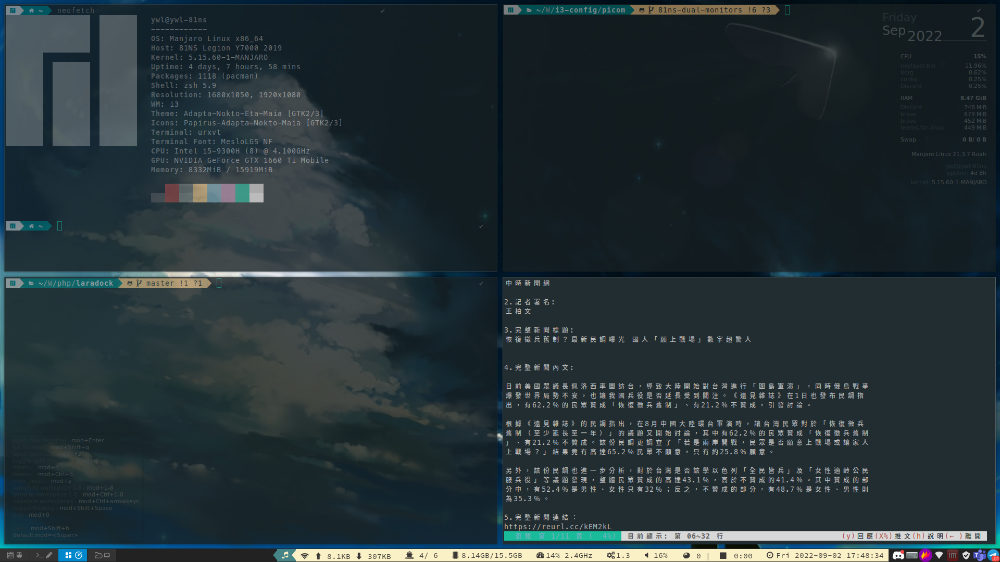

# README

誤砍家目錄方知痛
先備份 PC 上 i3-config，再 fork 成不同版本

repo 對應 $HOME/.config

## TODO

+ [x] status bar: i3-status
  icon provided by each app-self (e.g. nm-applet)
+ [x] X launcher: rofi
+ [x] compositor: picom
+ [x] background: nitrogen

## Screenshots

## References

+ [ArchWiki: i3](https://wiki.archlinux.org/title/i3_(%E7%AE%80%E4%BD%93%E4%B8%AD%E6%96%87))
